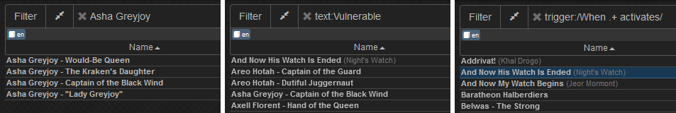
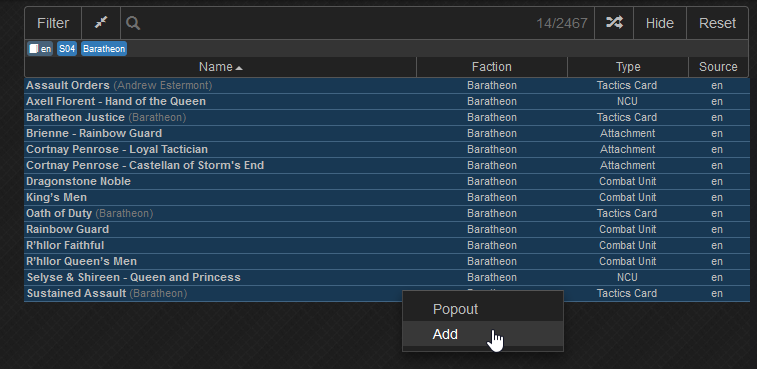
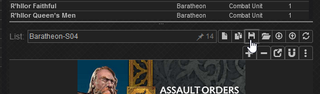
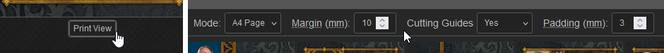
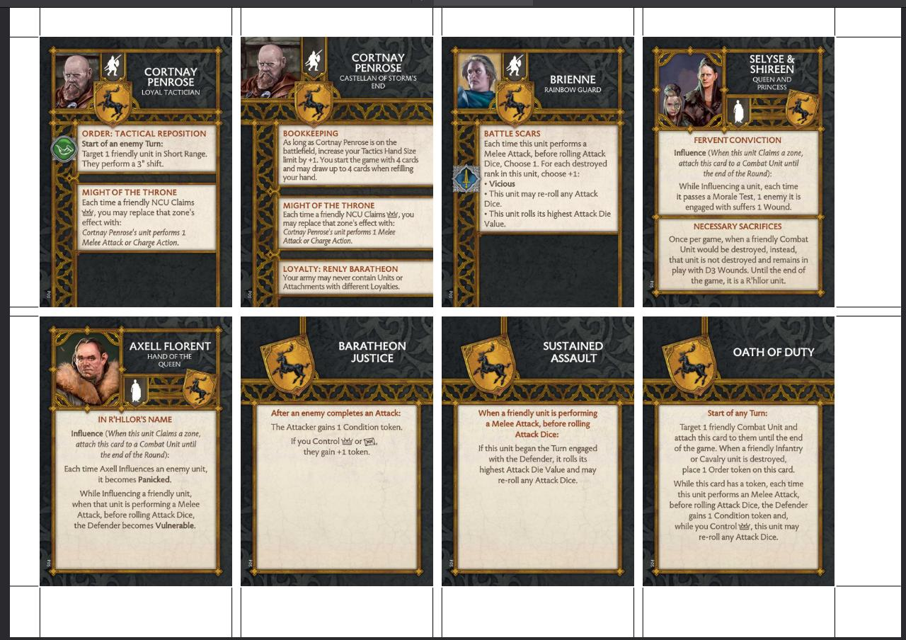

# asoiaf-tmg-data
This repository aims to provide all data and images required to start your own asoiaf:tmg projects. WIP

### Are you looking to filter and print cards?
Check out the deployed website [here](https://pf2etools.github.io/asoiaf-tmg-data/web/song.html).

Narrow down the selection by using filters...

... or the search function. Search with the keywords `text:` or `trigger:` to search the text or trigger instead of names. Regular expressions are also supported.

You can add multiple items to your list by selecting them while pressing `<SHIFT>`, then right-clicking on your selection.

Save and load lists.

Open the print view and select reasonable settings. We currently don't make sure everything fits on the page!

Click `Download PDF`, and your document will be prepared for you.

### Where is my stuff?
There's no account system. Everything is stored in cookies. If you wipe those, or close your incognito window, it's gone forever. You can download your data for safekeeping!

### Other neat things
Almost everything has tooltips.

## Planned Features
- [X] card backsides
- [ ] improve card backsides, card backsides for non-english languages
- [ ] ease of use improvements (for custom cards)
- [X] improved linebreak algorithm
- [ ] tts importer (also maybe)
