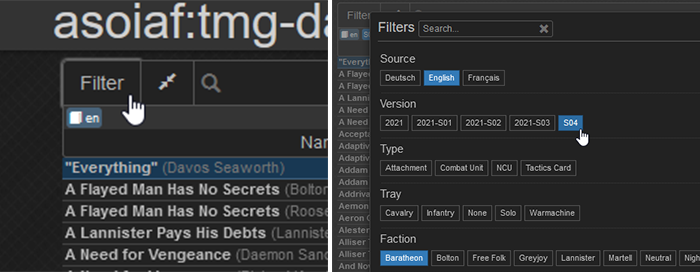

# asoiaf-tmg-data
This repository aims to provide all data and images required to start your own asoiaf:tmg projects.

## Are you looking to filter and print cards?
Check out the deployed website [here](https://pf2etools.github.io/asoiaf-tmg-data/web/song.html).

Narrow down the selection by using filters...

... or the search function. Search with the keywords `text:` or `trigger:` to search the text or trigger instead of names. Regular expressions are also supported.

You can add multiple items to your list by selecting them while pressing `<SHIFT>`, then right-clicking on your selection.

Save and load lists.

Open the print view and select reasonable settings. If you set a small margin, your printer might not be able to print the whole card!

Click `Download PDF`, and your document will be prepared for you.

### Where is my stuff?
There's no account system. Everything is stored in cookies. If you wipe those, or close your incognito window, it's gone forever. You can download your data for safekeeping!

### Other neat things
Almost everything has tooltips.

## Generating Custom Cards

It's perhaps not very beginner-friendly, but I'll be working on that.

### Installing Required Software (Windows)
1. Install [python](https://www.python.org/). Make sure to check `Add python.exe to PATH`, then click `Install Now`.
2. Download this repository: Click the green `<> Code` button, `download ZIP`, and unpack.
3. Install an IDE. I recommend [VSCode](https://code.visualstudio.com/), all the steps in this guide use it. But feel free to install your choice, or even skip this step.
4. Open the folder of this repository in VSCode.
5. Install the [python extension](https://marketplace.visualstudio.com/items?itemName=ms-python.python) for VSCode.
6. Open `py/generate_custom.py`. In the bottom right of statusbar, click on `Select Interpreter`, or the button that displays your python version.
7. Click `Create Virtual Environment`, `Venv`, the newest python version, then select `requirements.txt` and press `OK`.
8. You should be able to run the python script by pressing the play button in the upper right corner of the editor.

If everything went right, you should see no errors in the console, but a new blank line.

### Getting the Generator to Actually Generate Something
The generator `py/generate_custom.py` generates images from data in `custom/data/brew.json`. By default, it's an almost empty template, so nothing is generated. In general, all the data for this project is stored in `json` files, so you might want to get familiar with this file format.

At the top of `brew.json` is metadata. The author field is technically not needed, but it's nice to fill in if you want share the file. The `id` is used by the generator to locate assets and saved images. It should match the filename. The 2-letter language code determines where the generator looks to find ability text.

If you want to start adding data, and you don't know where to begin, it's good to simply copy a similar entry. You can find these entries in the `data` directory. I hope that most of the key/value pairs are named intuitively. Entries use a limited form of the Markdown formatting, that is * characters are used to indicate **bold** (`**bold**`) and *italic* (`*italic*`) text. These can also be ***combined***.

If you want to edit the abilities of units or attachments, it's important to know how the generator finds the ability text. Firstly, it will try to find the ability in the `abilities` object inside `brew.json`. Failing that, it will look in `abilities.json` of the language specified in the metadata, then the english language one. If the ability isn't found, it is simply ignored. Make sure the keys in the lookup are always capitalized.

If you run the script multiple times after edits, you might notice how cards haven't changed. That is because the generator is set to not overwrite existing files. You can delete the files you want to generate again, or at the bottom of the script, edit `overwrite=False` to `overwrite=True`.

## OBS Overlay
Install `obs/obs-overlay-user.js` as a userscript, and add `obs/asoiaf-tmg-data-overlay.py` as a script in OBS. Start the websocket from the script menu in OBS, the userscript will inject buttons on the website. When pressed, OBS will create a new source with the image on the current scene.
Very WIP (it's a techdemo really)

## Planned Features
- [X] card backsides
- [X] improve card backsides, card backsides for non-english languages
- [ ] ease of use improvements (for custom cards)
- [X] improved linebreak algorithm
- [ ] tts importer (also maybe)
